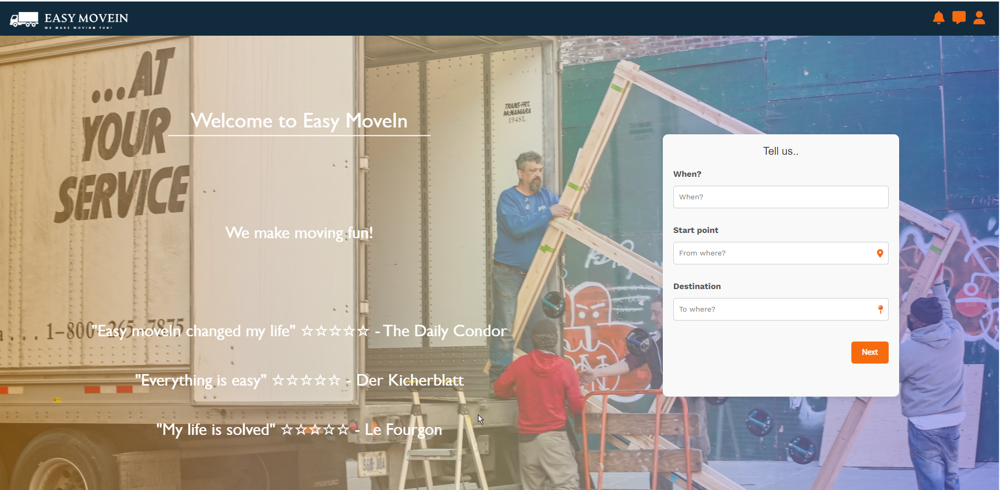

 

  

  <h3 align="center">EASYMoveIn</h3>

  

    We make moving fun
     
     
    <a href="http://www.ezmovein.me/">View Demo</a>
     
    <a href="https://github.com/Esti26/EASY_MOVE_IN"><strong>Explore the docs »</strong></a>
     
     
  

## Table Of Contents

* [About the Project](#about-the-project)
* [Built With](#built-with)
* [Authors](#authors)
* [Acknowledgements](#acknowledgements)

## About The Project

 Easy Move-In, a project we developed using Ruby on Rails, HTML, CSS, and JavaScript during our time at Le Wagon. This platform revolutionizes the way users transfer their belongings by implementing a unique bidding system. With Easy Move-In, users can easily find reliable service providers and receive competitive bids, ensuring a smooth and cost-effective moving experience.

## Built With

EasyMoveIN is  a web app hosted on Heroku using Ruby on Rails for the backend  and HTML, SCSS, CSS, and JavaScript (Stimulus) for the frontend. The app utilizes Geocoding for location tracking and Flatpicker for easy selection of dates and times. It offers a streamlined user experience, simplifying the moving process.

## Roadmap
Right now we are working to improve the app interface and fixing bugs

## Authors

[//]: contributor-faces

[//]: contributor-faces

## Acknowledgements

* [Le Wagon](https://www.lewagon.com/)- for all the staff, TA and specially our beloved batch manager Emma for making our final project possible
